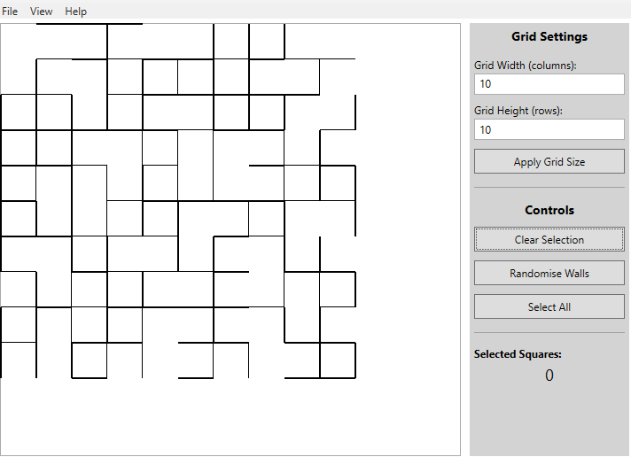
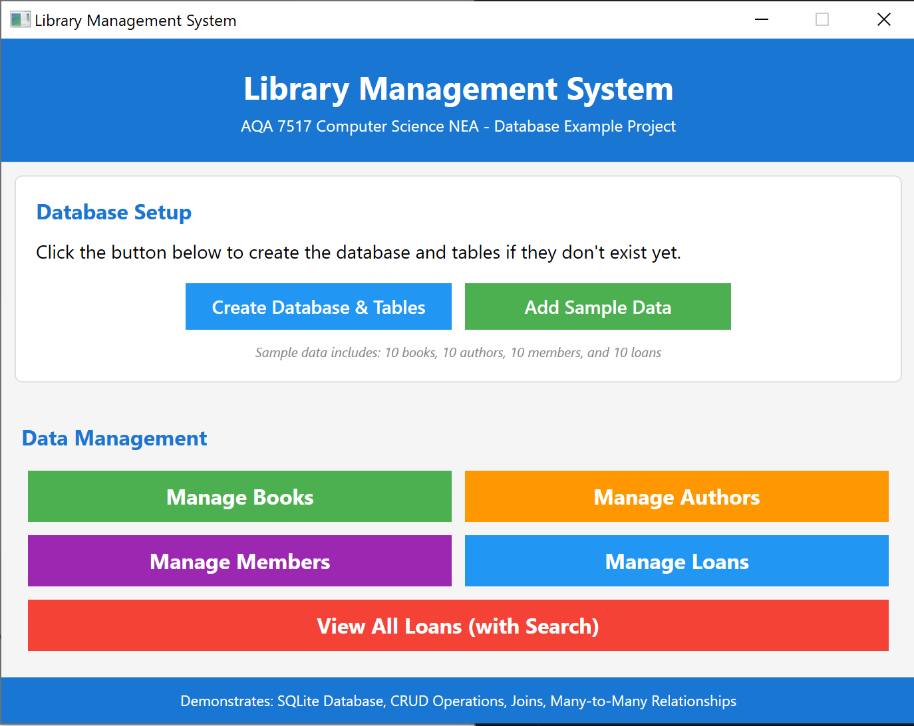

# 👋 Oliver Hall

Head of Computer Science at The King’s School, Chester.  
I provide structured C#/WPF exemplars to support students developing NEA projects, particularly those moving from console-based C# into desktop GUI applications.

- GitHub: https://github.com/MrHallKSC  
- Website: https://www.oliverhall.com/

---

## 🧩 Project exemplars

These repositories are provided as **reference exemplars**.  
They are intended to be studied, adapted, and extended — not copied — to support students in designing and justifying their own NEA projects.

---

## 🚦 C# / WPF starter exemplars (console → GUI)

| Project | Screenshot | Description | Key skills illustrated |
|-------|-----------|-------------|------------------------|
| **[TrafficLightWPF](https://github.com/MrHallKSC/TrafficLightWPF)** |  | A first WPF exemplar using a UK traffic light simulation. Demonstrates how a simple state machine can drive GUI behaviour using timers and events. Designed for students with no prior WPF experience. | XAML layout Code-behind Event handling Timers State machines |
| **[GridExemplarWPF](https://github.com/MrHallKSC/GridExemplarWPF)** |  | Renders a 2D grid of square cells onto a Canvas, with randomly assigned NESW walls and visual selection. Provides a clear separation between the data model and rendering. | 2D arrays Canvas drawing Model–view separation Coordinate systems |

---

## 🧱 C# / WPF complete application exemplars (NEA-style)

| Project | Screenshot | Description | Key skills illustrated |
|-------|-----------|-------------|------------------------|
| **[DatabaseExampleWPF](https://github.com/MrHallKSC/DatabaseExampleWPF)** |  | A cut-down library management system using SQLite. Illustrates how a desktop application can persist data and work with relationships in a relational database. | SQLite CRUD operations SQL JOINs Parameterised queries Data binding |
| **[SnookerWPF](https://github.com/MrHallKSC/SnookerWPF)** |  | A larger exemplar featuring a physics-driven snooker simulation. Intended to demonstrate scale, structure, and algorithmic complexity rather than act as a template solution. | OOP structure Simulation loops Collision handling Lists & iteration Applied maths |

---

## 🎯 Intended use

These exemplars are designed to:
- reduce the barrier to starting WPF-based NEA projects
- show realistic project scope and structure
- highlight patterns students can justify and adapt

They are **not** intended to be submitted as coursework.
